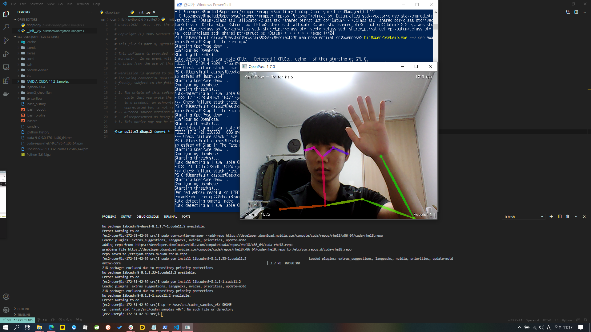
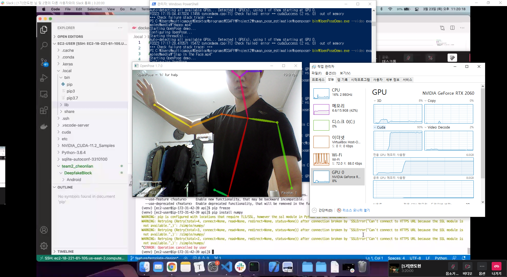
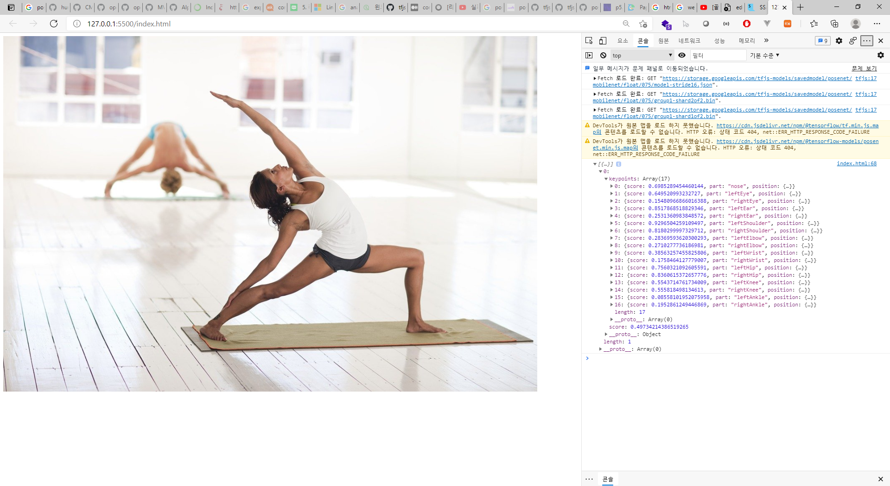
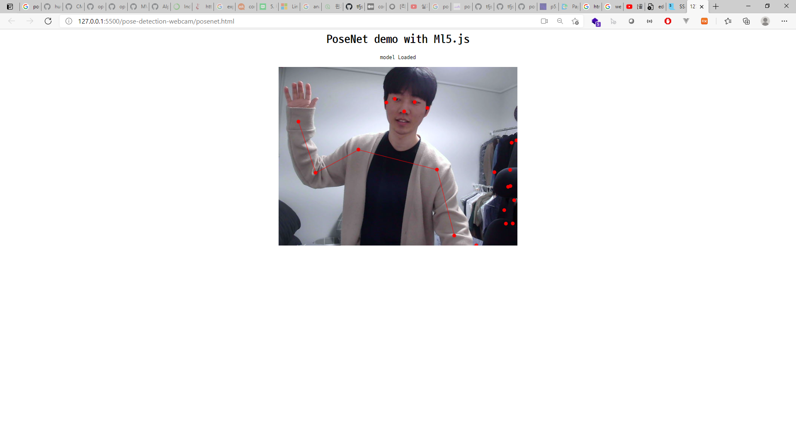

[TOC]

# study

## Pose estimation

google coral에서 지원하는 샘플 pose estimation을 colab에서 실행해보려는 시도를 했다.

[google-coral/project-posenet: Human Pose Detection on EdgeTPU (github.com)](https://github.com/google-coral/project-posenet)

[Software | Coral](https://coral.ai/software#pycoral-api)

[Get started with the Dev Board | Coral](https://coral.ai/docs/dev-board/get-started/#run-pycoral)

colab에 TPU로 런타임을 연결한다.

설치를 모두 하고 simple_pose.py를 실행하는데 오류가 났다.

```python
!python simple_pose.py
```

```
Traceback (most recent call last):
  File "simple_pose.py", line 15, in <module>
    from pose_engine import PoseEngine
  File "/content/gdrive/MyDrive/SSAFY/project-posenet/pose_engine.py", line 15, in <module>
    from pycoral.utils import edgetpu
  File "/usr/local/lib/python3.7/dist-packages/pycoral/utils/edgetpu.py", line 24, in <module>
    from pycoral.pybind._pywrap_coral import GetRuntimeVersion as get_runtime_version
ImportError: libedgetpu.so.1: cannot open shared object file: No such file or directory
```

`libedgetpu.so.1`는 so확장자인데, 이건 window 환경에서는 실행할 수 없다(?)는 듯 하다.

그래서 google coral 또는 리눅스 환경에서 실행해야할 것 같다.

그리고, colab의 TPU세션은 coral의 HTPU와는 달라서 사용할 수 없을지도 모른다.

지금 라즈베리파이가 다른 팀원에게 있는데, 이걸 vnc를 이용하면 원격으로 라즈베리파이 환경에 접속할 수 있다고 한다.

팀원이 이 환경에 연결할 때 까지 기다려야겠다.


### 0318

라즈베리파이, coral은 일단 보류하기로 하고 노트북을 임베디드장치로 사용해서 TV에 띄우기로 했다...

Pose estimation 코드를 받아서 실행을 해보려고 했다.

microsoft에서 만든 pose estimation 모델이다.

[microsoft/human-pose-estimation.pytorch: The project is an official implement of our ECCV2018 paper "Simple Baselines for Human Pose Estimation and Tracking(https://arxiv.org/abs/1804.06208)" (github.com)](https://github.com/microsoft/human-pose-estimation.pytorch)

이 모델을 실행하는데 여러가지 obstacle이 있었다.

1. Pretrain되지 않은 모델을 받으려다보니 데이터 용량이 자그마치 40gb
2. Linux에서 테스트된 코드라서 window에서 실행하기 까다로웠다.
3. 리눅스 가상환경을 설치해서 다운로드를 하고 training을 시도하니 gpu가 설정이 안돼있어서 cuda를 사용하지 못했다.

해결 방법은

1. 끈기있게 기다린다.
2. build하는 부분에서 문제가 발생하는데, `python setup.py build_ext` 명령어를 사용하니까 cpu_nms.pyx파일을 실행하려고 하는데 이 파일이 없다.  
   추측은.. build를 하면 pyx파일을 생성해야 하는데 잘못된 path설정으로 파일 생성이 안되는 것?  
   linux에서는 build가 됐는데 cuda를 사용하지 못한 build일 것 같아서 참고하는게 도움이 될지 잘 모르겠다..
3. 사실 2번을 하기 전에 먼저 3번을 진행했는데, 데이터 받는데 거의 한나절이 걸렸다.  
   모든 환경설정이 끝나고 이제 `python valid.py`, `python train.py` 명령어로 훈련을 시작하면 되는데 작동이 안됐다.  
   알고보니 virtual box 가상환경을 사용하여 linux를 돌렸는데, 가상환경 안에서는 gpu또한 가상이었던 것.  
   구글링 해보면 virtualbox에서 현재 pc의 gpu를 사용할 수 있는  방법이 있겠지만 그 방법보다 window에서 모델을 돌리는게 더 빠를 것 같아서 그렇게 했다. 그런데 그것도 쉽진 않다.


생각한 것 보다 데이터 용량이 크고, 환경설정이 힘들어서 진도가 느리다.

그래도 오늘 새벽에는 2번이나 3번 중 적어도 한 방법으로 해결해보려고 한다.


### 0319

alphapose라는 새로운 pose estimation를 찾았다. 이건 가장 좋은 점이 colab으로 preview를 할 수 있다는 점.

[MVIG-SJTU/AlphaPose: Real-Time and Accurate Full-Body Multi-Person Pose Estimation&Tracking System (github.com)](https://github.com/MVIG-SJTU/AlphaPose)

colab으로 돌려보니 포즈를 잘 찾는다. 그런데 input을 사진으로 받는 코드라서 webcam을 사용하려면 조금 수정해야겠다.

colab에서 webcam을 이용하는 방법은 google에서 지원하는 스니펫을 활용하면 된다. colab은 서버인데 webcam은 로컬에 연결되어있어서 colab이 바로 영상을 읽을 수 없다. 그래서 스니펫에서 사용하는 방법은, javascript를 사용해서 로컬의 영상데이터를 서버로 전송해 읽어들이는 방법이다.


갑자기 javascript하니까 tensorflow.js가 생각났다. 그래서 공식 홈페이지에 들어가봤더니

[All Experiments | Experiments with Google](https://experiments.withgoogle.com/experiments?tag=PoseNet)

human pose estimation을 활용한 여러가지 프로그램을 오픈소스로 공개한다.

PoseNet은 coral할때 봤던 pose estimation 이다. 추측하건데, 그 때 봤던건 coral의 HTPU를 사용하도록 일부 수정되어 제공된 코드이고, 오리지날 PoseNet이 존재하는 것 같다.

영상데이터는 용량이 크니까 back까지 안가고 front단에서 tensorflow.js로 가동시킬 수 있다면 데이터 전송 측면에서 큰 이익을 볼 것 같다.


### 0320

PoseNet은 javascript에서 돌아가는 거라서 서버에 올릴 수 있다.

그런데 문제점이 좀 있다.

- 서버에 올려서 여러 실호를 받다보면 속도가 좀 느려진다. (사실 별로 안느려질거같음)
- 임베디드를 활용하는 도전적인 면이 없다.

2번 때문에 컨설턴트님께서는 임베디드단에서 돌리라고 하시는 것 같다.

사실 서비스 측면에서는 빠르게 만들 수 있는 서버에 올리는 방법을 택하는게 좋겠지만 지금 프로젝트는 학습에 초점이 맞춰져있기 때문에 임베디드를 사용하는 것이 의의가 있을 것 같다.

그리고 PoseNet은 사용을 해봤는데... google에서 만든 것 치고는 성능이 영 별로다.

그래서 AlphaPose를 사용하기로 마음 먹었다.


### 0321

OpenPose와 PoseNet 모두 돌려봤다.

- OpenPose

  

  

  작동은 잘 되는데.. cuda memory를 너무 많이 잡아먹는다.

  그래서 webcam을 pose estimating하는데 90% 메모리를 사용하고,

  video를 pose estimating은 out of memory 에러가 뜬다.

  

  

  체조의 정확도를 비교하기 위해서는 video를 변환해야 한다.

  메모리 부족 문제를 해결하기 위해서 다음과 같은 방법들이 가능할 것 같다.

  1. cuda memory 늘리기
  2. input video 해상도 낮추기
  3. OpenPose에 메모리 사용량 절약 방법 있는지 알아보기
  4. AWS 서버 또는 colab에서 비디오 변환한 후 가져오기

  2번은 해상도를 640 * 360으로 낮췄는데도 불구하고 안됐다.

  4번은 변환된 비디오는 생성 가능할텐데 관절의 좌표를 추출해내기 힘들 것 같다.

  

  우선 3번을 먼저 해보고 그 다음으로 1번 -> 4번 순서로 해봐야겠다.


- PoseNet (Tensorflow.js)

  이건 javascript를 사용하는 방법이다.

  원래 사용 안하려고 했는데... 확실히 이 방법이 편하긴 하다.

  html 파일을 만들고,

  ```html
  <html>
    <head>
      <!-- Load TensorFlow.js -->
      <script src="https://cdn.jsdelivr.net/npm/@tensorflow/tfjs"></script>
      <!-- Load Posenet -->
      <script src="https://cdn.jsdelivr.net/npm/@tensorflow-models/posenet"></script>
    </head>
  
    <body>
      
    </body>
  
    <script>
      var flipHorizontal = false;
  
      var imageElement = document.getElementById('cat');
  
      posenet.load().then(function(net) {
        const pose = net.estimateMultiplePoses(imageElement, {
          flipHorizontal: true,
          maxDetections: 1,
        });
        return pose;
      }).then(function(pose){
        console.log(pose)
      })
    </script>
  </html>
  ```

  이게 끝이다.

  

  

  물론 Webcam을 이용하려면 조금 더 복잡해지겠지만, 

  webcam에서 프레임마다 이미지를 캡쳐해서 Pose estimating한 후 return해주면 될 것이다.

  webcam을 이미 활용가능한 모델이 있는데..

  

  Ml5.js라는 라이브러리이다.

  그런데 보다시피 오른쪽 사람이라고 잘못 인식한 옷더미들이 있다.

  사람을 한명만 인식하게 하기 위해서 maxPoseDetection을 1로 바꿔도, type을 'single'로 바꿔도 적용되지 않는다.

  이 부분을 해결하기 위해 다음의 방법을 이용할 수 있을 것 같다.

  1. Ml5.js 라이브러리에서 single detection 하는 방법을 google에서 찾아보기
  2. Ml5를 사용하지 않고 순수한 PoseNet에서 웹캠을 이미지로 입력해주기

  1번의 경우는 이미 Ml5 홈페이지에 적혀있는 방법을 사용했는데도 되지 않았기 때문에 해결하는 방법을 찾을 수 없을지도 모른다.

  ->  찾을 수 있을 확률이 크다

  2번은 웹캠 입력을 하더라도 이미지 뼈다귀를 그려주는 코드도 작성해야 한다.

  -> Ml5.js에 친절히 코드가 작성되어있어서 참고하면 된다.


OpenPose, PoseNet 둘 다 장단점이 있었다.

OpenPose는 디텍팅 성능이 훨씬 좋았다.

그러나 GPU 메모리를 많이 잡아먹고, Python파일이기 때문에 웹페이지에 자연스럽게 띄우기가 힘들 것이다.

또한, joint의 위치를 출력하는 작업이 남아있다.


PoseNet은 디텍팅 성능이 확실히 떨어진다.

사람이 아닌 것을 사람이라고 착각을 많이 하기 때문에 single pose estimation을 하는게 필수적이다.

그리고 cpu를 사용하기 때문에 라즈베리파이에서 작동이 힘들 수 있다.

(어차피 OpenPose도 못쓴다. gpu라서... 결국 라즈베리파이를 쓸라면 coral에서 돌리는 코드를 새로 찾아야 한다.)

그렇지만 javascript로 작성되었기 때문에 웹서비스에 삽입하기가 쉽고, 자연스럽다.


오늘은 여기까지 해봤고.. 이제 두 모델 중 선택을 하고, 해당 모델의 문제점을 해결해야겠다.